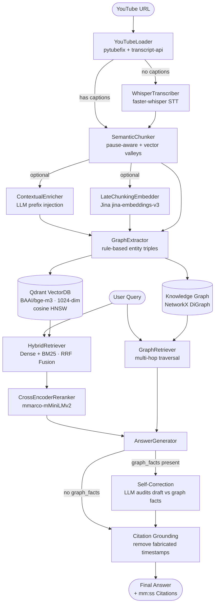

<p align="center">
  
  
  
  
  
  
  
  
</p>

# YouRAG — Advanced YouTube RAG with Knowledge Graph & Self-Correction

**YouRAG** is a production-grade **Retrieval-Augmented Generation (RAG)** system that turns any YouTube video into a queryable knowledge base. It combines **Knowledge Graph**, **Hybrid Search**, **Cross-Encoder Reranking**, **Citation Grounding**, and **Graph-based Self-Correction** — state-of-the-art techniques that eliminate hallucination at the architecture level.

> Not just a video chatbot. YouRAG builds a "digital brain" for each video: extracts entities, builds a knowledge graph, validates every citation, and forces the AI to cross-check facts before answering.

---

## Architecture



---

## Key Features

### Anti-Hallucination Stack
- **Strict system prompt** — "If not in the document, say you don't know"
- **Self-Correction** — LLM audits its own draft against Knowledge Graph facts before returning
- **Citation Grounding** — Every `[mm:ss]` in the answer is validated against retrieved chunks; fabricated citations are removed
- **No-context early return** — Returns "not found" immediately when no chunks are retrieved, instead of letting the LLM hallucinate from general knowledge
- **Stream self-correction** — In streaming mode with graph facts, draft is generated + corrected first, then streamed word-by-word

### RAG Pipeline
- **2-Phase Semantic Chunking**: Pause-aware atomic splitting + vector semantic valley detection (dynamic percentile threshold, adapts per video)
- **Knowledge Graph**: Extracts `(subject, predicate, object)` triples → NetworkX directed graph → multi-hop reasoning
- **Hybrid Search + RRF**: Dense (Qdrant bge-m3) + Sparse (BM25) fused with Reciprocal Rank Fusion
- **Cross-Encoder Reranking**: mmarco-mMiniLMv2 for precise relevance scoring
- **Semantic Cache**: Per-collection Qdrant-backed cache — same question on different videos never cross-contaminates

### Production Hardening
- **API key authentication** — `X-API-Key` header protects all write endpoints
- **Rate limiting** — slowapi: 20 req/min for chat, 5 req/min for ingest
- **YouTube URL validation** — Backend validates URL before queuing job (HTTP 422 on invalid)
- **Redis job store** — Ingest jobs persist in Redis with 24h TTL; auto-fallback to in-memory in dev
- **`/health` endpoint** — Checks Qdrant, Redis, Generator, Reranker; returns `200` or `503`
- **Groq key rotation** — Auto-rotate backup keys when primary hits rate limit (`GROQ_API_KEYS`)
- **Whisper STT fallback** — Auto-transcribes videos without captions via faster-whisper

### Frontend (Next.js 14)
- Dark / Light mode toggle
- Mobile responsive — drawer sidebar + tab layout on small screens
- Dynamic welcome suggestions — 4 questions generated from actual video content
- Source chips with seek-to-timestamp + open YouTube at exact timestamp
- Simplified ingest progress bar

---

## Tech Stack

| Component | Technology |
|---|---|
| Backend API | FastAPI 0.110 + Uvicorn |
| Frontend | Next.js 14, TypeScript, Tailwind CSS |
| Vector DB | Qdrant (HNSW, cosine similarity) |
| Embeddings | BAAI/bge-m3 (1024-dim, multilingual) |
| Reranker | cross-encoder/mmarco-mMiniLMv2-L12-H384-v1 |
| LLM primary | Groq llama-3.3-70b-versatile |
| LLM fallback | Groq backup key rotation (`GROQ_API_KEYS`) |
| Chat history | PostgreSQL 15 + Redis 7 (dual-layer) |
| BM25 | rank-bm25 |
| Knowledge Graph | NetworkX (JSON serialization, no pickle) |
| Evaluation | RAGAS framework |
| Build | uv (Docker), Poetry (local/CI) |
| CI/CD | GitHub Actions — Ruff + Bandit + Pytest |

---

## Quick Start

### Requirements
- Docker + Docker Compose
- [Groq API Key](https://console.groq.com/keys) (free)

### 1. Clone & Configure

```bash
git clone https://github.com/td041/YouRAG.git
cd YouRAG
cp .env.example .env
# Edit .env and set GROQ_API_KEY
```

### 2. Start

```bash
docker compose up -d --build
```

### 3. Access

| Service | URL |
|---|---|
| Frontend | http://localhost:3000 |
| Backend API | http://localhost:8000 |
| API Docs | http://localhost:8000/docs |
| Health Check | http://localhost:8000/health |

---

## API Endpoints

| Method | Endpoint | Auth | Description |
|---|---|---|---|
| `GET` | `/` | — | Status check |
| `GET` | `/health` | — | Deep health check (Qdrant, Redis, models) |
| `GET` | `/collections` | — | List ingested videos |
| `POST` | `/ingest` | ✅ | Ingest YouTube video (async, returns job_id) |
| `GET` | `/ingest/status/{job_id}` | — | Poll ingest job status |
| `POST` | `/chat` | ✅ | RAG chat (sync) |
| `POST` | `/chat/stream` | ✅ | RAG chat (streaming) |
| `GET` | `/suggestions/{collection}` | ✅ | Get 4 dynamic suggested questions |
| `GET` | `/summarize/{collection}` | ✅ | Video summary |
| `GET` | `/history/{session_id}` | — | Chat history |
| `POST` | `/graph/build/{collection}` | ✅ | Build/rebuild knowledge graph |
| `DELETE` | `/collections/{name}` | ✅ | Delete video |

Protected endpoints require `X-API-Key` header when `API_KEY` is set in `.env`.

---

## Testing

```bash
# Unit tests (211 tests, 83% coverage, all mocked)
poetry run pytest tests/unit/ -v --cov=src --cov-report=term-missing

# Lint
poetry run ruff check src/ tests/

# Security
poetry run bandit -r src/ -ll

# RAGAS benchmark
make benchmark
# or with specific collection:
make benchmark COLLECTION=your-collection-name
```

---

## Benchmark Results

Evaluated on **20 questions** (mixed difficulty: factual, reasoning, comparative, synthesis) using:
- **Generation:** `llama-3.3-70b-versatile` via Groq
- **Evaluator:** `mistral-small-latest` via Mistral AI
- **Reranker:** `BAAI/bge-reranker-v2-m3`
- **Embeddings (eval):** `paraphrase-multilingual-MiniLM-L12-v2` (multilingual)

| Metric | Naive (Dense) | Hybrid (RRF) | Advanced (Rerank) |
|---|---|---|---|
| **Faithfulness** | 0.851 | **0.929** ✅ | 0.843 |
| **Answer Relevancy** | 0.767 | **0.832** ✅ | 0.782 |
| **Context Precision** | **0.936** ✅ | 0.935 | 0.902 |
| **Context Recall** | **1.000** ✅ | 0.988 | 0.963 |
| **Factual Correctness** | 0.733 | **0.777** ✅ | 0.737 |
| **Latency (s)** | 1.79 | 1.65 | 4.74 |

> Hybrid retrieval (Dense + BM25 + RRF) achieves the best balance across all metrics. Context Recall = 1.0 on Naive indicates no information is missed at the retrieval stage.

---

## Environment Variables

See [.env.example](.env.example) for full reference.

| Variable | Required | Description |
|---|---|---|
| `GROQ_API_KEY` | ✅ | Primary LLM (llama-3.3-70b) |
| `GROQ_API_KEYS` | Optional | Backup Groq keys (comma-separated) for benchmark rotation |
| `API_KEY` | Recommended | Protects write endpoints |
| `MISTRAL_EVAL_API_KEY` | Recommended | RAGAS benchmark evaluator (no daily quota) |
| `JINA_API_KEY` | Optional | Late Chunking embeddings |
| `QDRANT_SERVER_URL` | Production | Qdrant Cloud URL |

---

## Roadmap

- [x] Semantic Chunking (pause-aware + vector valleys)
- [x] Knowledge Graph RAG (entity extraction + multi-hop)
- [x] Hybrid Search + RRF Fusion
- [x] Cross-Encoder Reranking
- [x] Graph-based Self-Correction
- [x] Citation Grounding (no fabricated timestamps)
- [x] Streaming + [mm:ss] Citations
- [x] Whisper STT fallback
- [x] Persistent Chat History (Redis + PostgreSQL)
- [x] Dark/Light mode + Mobile responsive UI
- [x] API Key auth + Rate limiting
- [x] Redis job store + /health endpoint
- [x] Groq backup key rotation
- [x] Docker Compose (5 services) + uv fast builds
- [x] CI/CD (Ruff + Bandit + Pytest, 83% coverage)
- [ ] Multi-video cross-referencing
- [ ] Deploy to Railway + Vercel
- [ ] Sentry monitoring

---

<p align="center">
  <b>Built by <a href="https://github.com/td041">td041</a></b>
</p>
